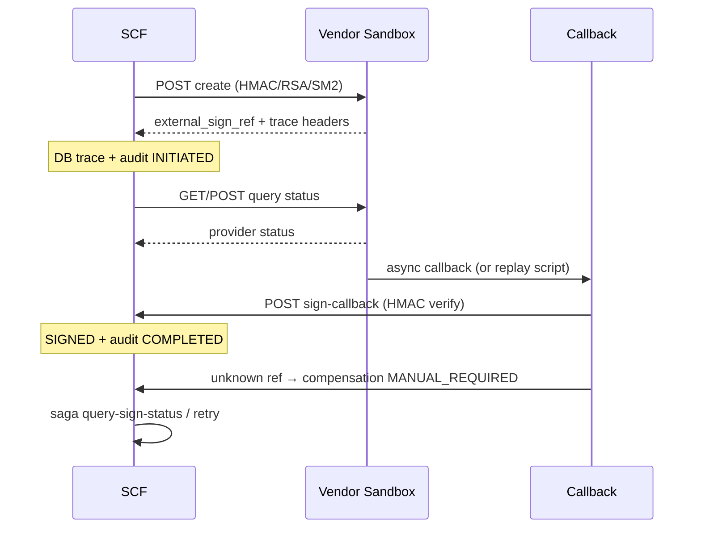

# EA-046 Sandbox 执行手册

**目标：** 在供应商**真实沙箱**完成签章闭环，产出可签核证据包，证明从「代码可联调」进入「供应商真实可用」。

## 0. 前置

1. Backend 已部署 `prod` profile，Flyway ≥ `1.1.034`。
2. 拿到供应商沙箱：base URL、appId、密钥、回调白名单、API 文档版本。
3. 在 SCF 侧准备测试单证（已审核、待签署、PDF 已上传）。
4. 填写 `ESIGN_VENDOR_FIELD_MAP.md` 中该 vendor 的字段映射（若与默认不同，同步 `application-prod.yml` 或 env）。

## 1. 配置 `.env.esign-sandbox`（约 15 min）

```powershell
cd <repo>\deploy\pilot
copy .env.esign-sandbox.example .env.esign-sandbox
notepad .env.esign-sandbox
```

必填：

| 变量 | 说明 |
|---|---|
| `SCF_BASE_URL` | 含 `/api/v1`，例 `https://scf-sandbox.example.com/api/v1` |
| `SCF_LOGIN_NAME` / `SCF_LOGIN_PASSWORD` | 平台管理员 |
| `SCF_ESIGN_DOCUMENT_ID` | 沙箱测试单证 ID |
| `SCF_CONTRACT_SIGN_HTTP_*` | 供应商沙箱 endpoint + 密钥 |
| `SCF_CONTRACT_SIGN_CALLBACK_TOKEN` | 与供应商共享的回调 HMAC 密钥 |
| `SCF_VENDOR_CALLBACK_URL` | 已在供应商控制台登记的 URL |

校验：

```powershell
Select-String -Path .env.esign-sandbox -Pattern 'CHANGE_ME'   # 应无输出
.\scripts\verify-contract-sign-config.ps1 -EnvFile .\.env.esign-sandbox
```

## 2. 一键证据采集（推荐）

```powershell
.\scripts\run-ea046-sandbox-evidence.ps1 -EnvFile .\.env.esign-sandbox
```

可选参数：

| 参数 | 用途 |
|---|---|
| `-SkipInitiate` | 已发起过签署，设 `SCF_ESIGN_EXTERNAL_SIGN_REF` |
| `-SkipCallbackReplay` | 仅依赖供应商真实回调 |
| `-SkipDbExport` | 无 psql 时跳过 SQL 导出 |

产出目录：`evidence/contract-sign-sandbox/ea046-YYYYMMDD-HHmmss/`

| 文件 | 说明 |
|---|---|
| `ea046-*.json` | 机器可读证据（schema 见同级 `ea046-evidence.schema.json`） |
| `ea046-*.summary.md` | 人类摘要 |
| `initiate-response.json` | 真实出站发起 |
| `query-status-response.json` | 真实查单 |
| `callback-*.json` | 回调验签 / 幂等 |
| `compensation-*.json` | 补偿池 + Saga |
| `db-export.log` | trace + 审计 SQL 快照 |

## 3. 分步（排障）

```powershell
# 配置探针
.\scripts\verify-contract-sign-config.ps1

# 仅重放回调（需 SCF_BASE_URL 含 /api/v1）
$env:SCF_BASE_URL = "https://..."
$env:SCF_CONTRACT_SIGN_CALLBACK_TOKEN = "..."
.\scripts\replay-contract-sign-callback.ps1 -ExternalSignRef "HTTP-FLOW-xxx"

# DB  trace 导出
$env:PGPASSWORD = "..."
psql -h ... -U scf -d scf -v "ref='HTTP-FLOW-xxx'" -f .\scripts\export-contract-sign-evidence.sql
```

## 4. 闭环场景说明



## 5. PASS 后

1. 勾选 [`EA-046 Checklist`](EA-046_供应商Sandbox联调证据包Checklist.md)。
2. 填写 [`EA-046 验收结果`](EA-046_供应商Sandbox联调证据包验收结果_20260601.md)。
3. 将脱敏 `summary.md` + `ea046-*.json` 归档至工单/发布系统。
4. 决策 **Go** → 进入 staging/试点 prod（沿用 EA-035 闸门）。

## 6. FAIL 路由

| 失败 | 可能原因 | 动作 |
|---|---|---|
| CONFIG not configured | env 未注入 backend | 查 pod env / `application-prod.yml` |
| INITIATE 502 | 出站鉴权/字段映射 | 对照 `ESIGN_VENDOR_FIELD_MAP.md` |
| QUERY 502 | status-path 或响应字段 | 调 `response-*-field` |
| CALLBACK 403 | callback-token 不一致 | 与供应商对齐 HMAC secret |
| 无 trace 列 | Flyway 034 未执行 | 查 `flyway_schema_history` |
| SAGA 403 | 权限不足 | 用 platform_admin 身份 |

> 注意：幂等重放验证应保持同一个 `X-Idempotency-Key` 和相同 payload，但必须使用新的 `X-Contract-Sign-Nonce` 并重新计算签名。后端会先做 nonce 防重放，再进入幂等服务；重复 nonce 会按安全重放攻击拒绝。
